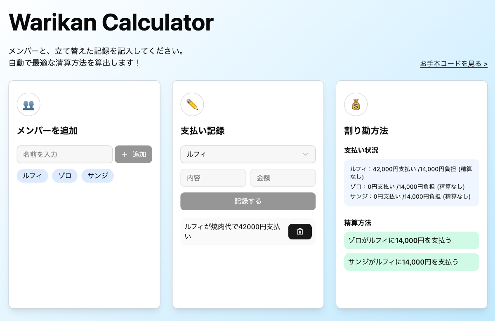

# Warikan Calculator (Learning Purpose)

This is a simple web application that calculates the amount each person should pay when splitting a bill.

This app is based on the hands-on session project from [Blueberry Mojito (b13o)](https://b13o.com/), a React learning community.

<picture>
   <source srcset="./public/screenshot.webp" type="image/webp">
   
</picture>


> [!Note]
> This repository is for personal learning and demonstration purposes only.

## Demo
[View Demo](https://oumelab.github.io/demo-warikan-calculator/)

## Features
- Member Registration: Easily add group members
- Payment Records: Record who paid how much for what
- Automatic Settlement Calculation: Automatically calculates the optimal settlement method with minimum transactions


 ## Technologies Used
 - React, TypeScript
 - Zustand
 - Tailwind CSS, shadcn/ui
 - React Router
 - Vite
 - GitHub Pages (deployment)

 ## What I Learned

 ### State Management with Zustand
 I used `Zustand` to efficiently manage the application state. The following points were particularly valuable:

- Efficient state management with minimal boilerplate code
- Using selector functions for performance optimization
- Integrated management of both form input states and persistent data

```typescript
// Retrieve states individually to prevent unnecessary re-renders
const members = useCalcStore((state) => state.members);
const expenses = useCalcStore((state) => state.expenses);
```

### Separation of Logic with Custom Hooks
I created custom hooks to separate business logic from UI:

- `useCalcLogic`: Handles expense-splitting calculation logic
- Centralization of reusable logic
- Code structure that is easier to test

```typescript
// Cache calculation results using useMemo
const { balances, settlements } = useMemo(() => {
  // Calculation logic
}, [members, expenses, totalExpenses]);
```

### Algorithm Implementation
I implemented the following algorithm for expense settlement calculations:

- Greedy algorithm to minimize the number of transactions
- Matching payers with receivers
- Simple settlement procedure through transactions between two parties

### Deployment to GitHub Pages
I solved challenges with deploying a SPA using `React Router` to GitHub Pages:

- Using `HashRouter` to ensure proper routing
- Properly configuring the base path
- Automated deployment pipeline with GitHub Actions

```yaml
- name: Build
  run: |
    # Get repository name and set base path for build
    REPO_NAME=${GITHUB_REPOSITORY#*/}
    bun run build --base=/$REPO_NAME/
```

### Future Improvements
- [ ] Data persistence (LocalStorage or IndexedDB)
- [ ] Managing multiple groups
- [ ] Adding history functionality
- [ ] Theme customization